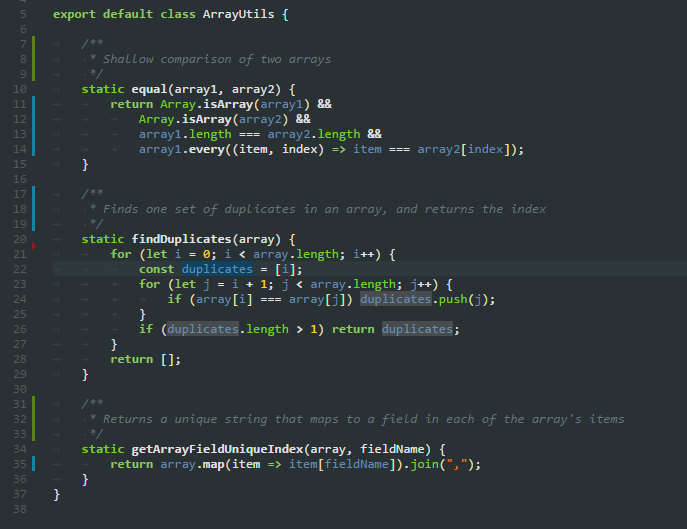

# (Actual) Obsidian

  

Obsidian theme for Visual Studio Code, based on [the original Obsidian Theme for Eclipse](http://www.eclipsecolorthemes.org/?view=theme&id=21).

The theme file itself has been mostly based on [the work of Marcus Ekwall for TextMate](https://github.com/mekwall/obsidian-color-scheme) when porting the same theme. However, for some reason, some colors had to be corrected for Visual Studio Code.

## Installing

In Visual Studio Code, run `ext install theme-actual-obsidian`, or search for "Obsidian" in the Extension tab (Ctrl/CMD + Shift + P).

## License

This work is licensed under the MIT License. See [LICENSE](LICENSE) for details.
